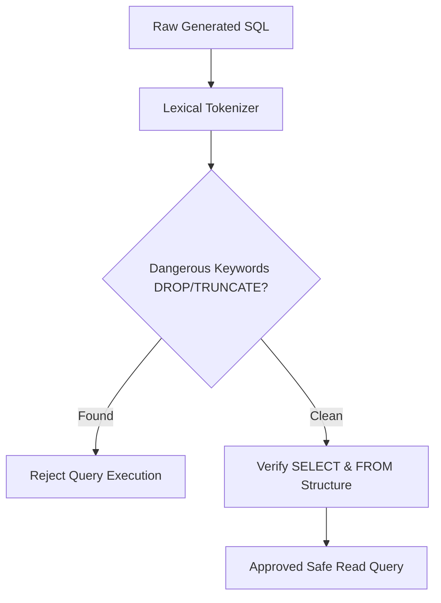

# genpark-sql-syntax-abstract-syntax-tree-validator-skill

Read-only SQL grammar parser and AST injection guard preventing destructive SQL execution in database agents.

## Architecture

## Features
- **Strict Read-Only Enforcement**: Blocks DROP, TRUNCATE, ALTER, EXEC.
- **Zero Dependencies**: 100% Python Standard Library.
